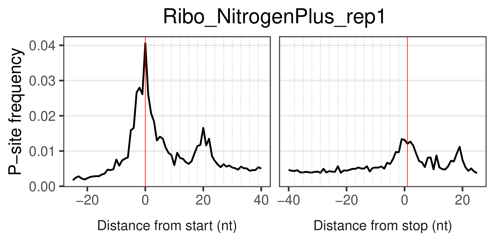
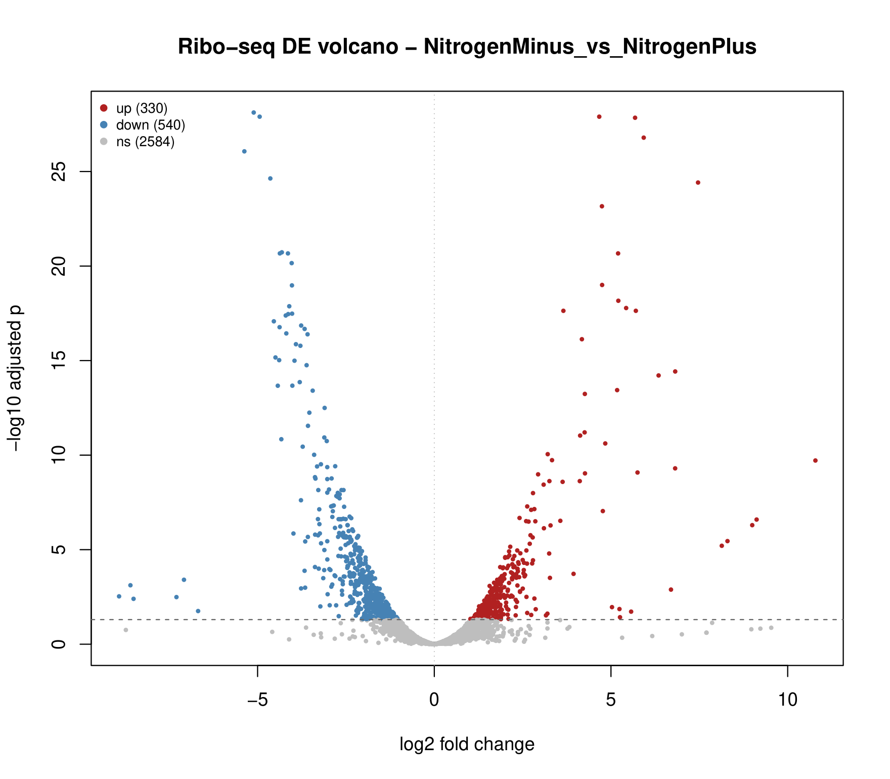
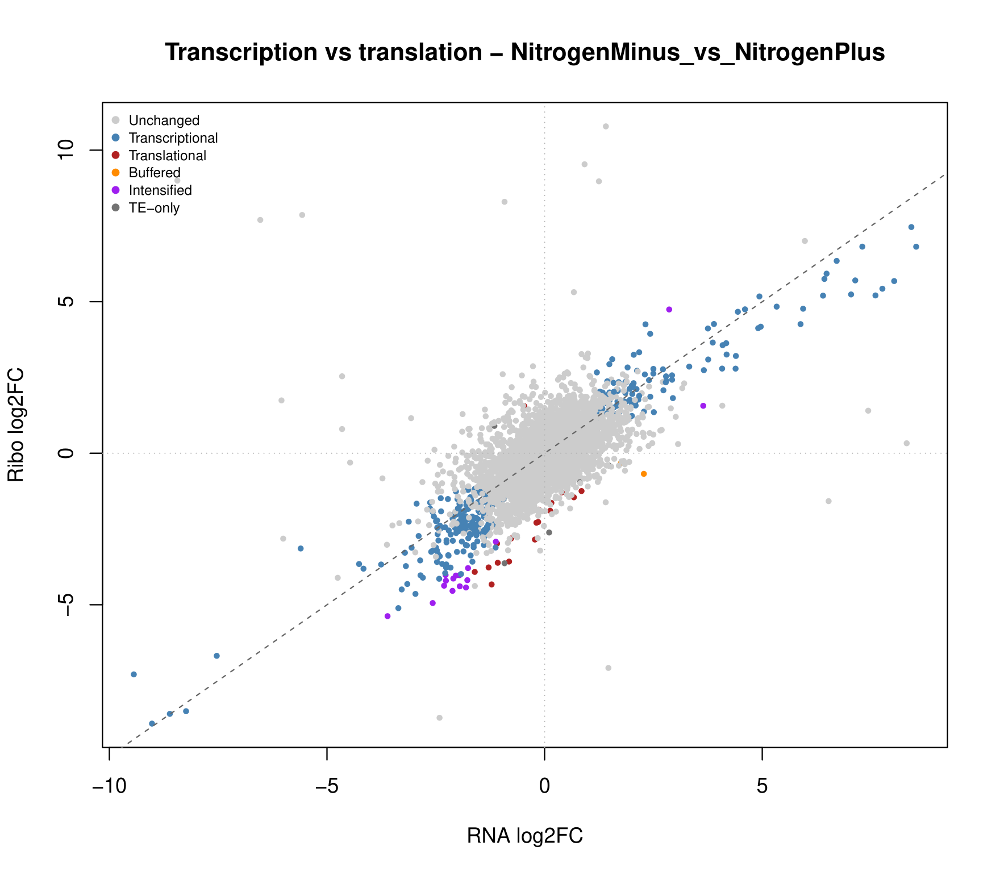
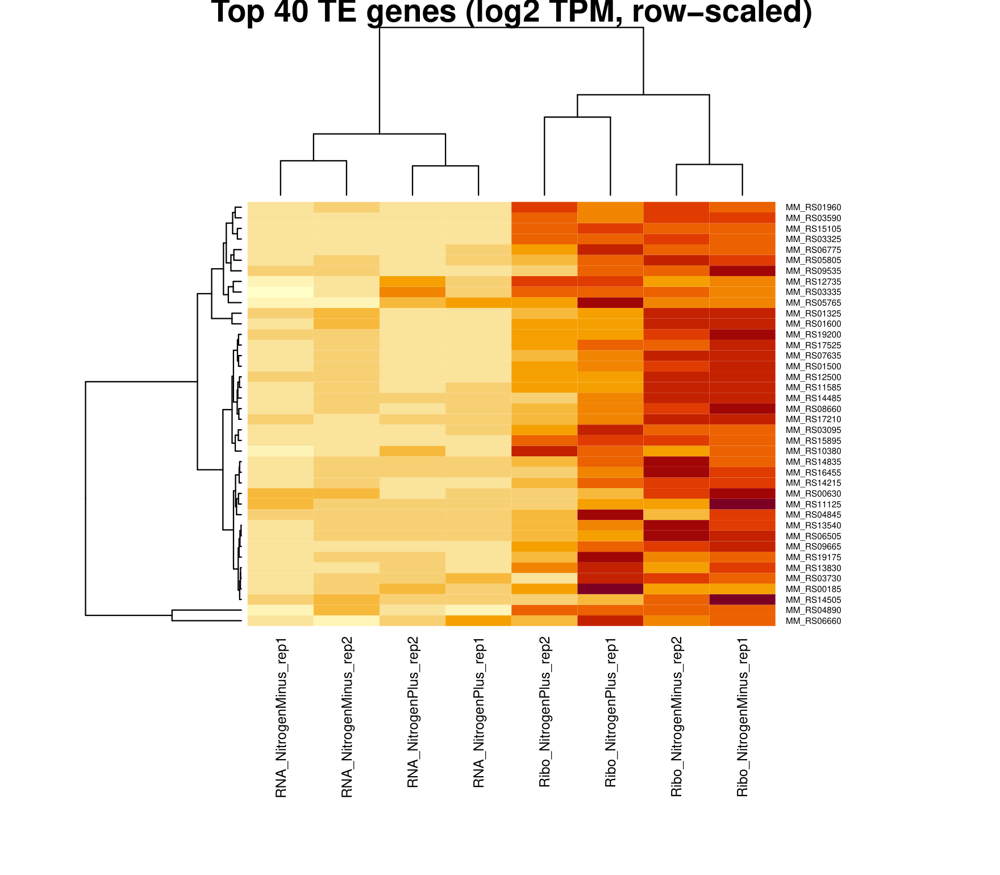

# Translational control under nitrogen limitation in *Methanosarcina mazei*

## Summary

This repository contains a complete ribosome-profiling analysis comparing
nitrogen-replete and nitrogen-limited growth in the methanogenic archaeon
*Methanosarcina mazei* strain Go1. Paired RNA-seq and Ribo-seq libraries
from two biological replicates per condition were aligned and quantified
with the nf-core/riboseq pipeline, and translational efficiency, the ratio
of ribosome occupancy to transcript abundance, was estimated independently
by three published methods (DESeq2 interaction modelling, Xtail, and
riborex) and reconciled into a single results table. Of 3,478 genes with
sufficient coverage in both assays, 309 show a significant change in mRNA
abundance without a corresponding change in translational efficiency
(transcriptional regulation), while a smaller set of 17 to 62 genes,
depending on method, show translational efficiency changes independent of
transcript level (translational regulation). The analysis, including every
script needed to reproduce it from raw reads, is provided here.

## Background

Ribosome profiling (Ribo-seq) captures the positions of translating
ribosomes on mRNA at nucleotide resolution by sequencing the RNA fragments
they protect from nuclease digestion. Read alone, a Ribo-seq library
measures translational output; compared against a matched RNA-seq library
from the same biological sample, it allows translational efficiency, the
number of ribosomes engaged per transcript, to be estimated directly. A
change in translational efficiency between two conditions indicates that
gene expression is being controlled at the level of translation rather
than transcription, a regulatory layer that standard RNA-seq cannot see on
its own.

Nitrogen availability is one of the principal environmental signals
governing growth and metabolism in methanogenic archaea, and prior work has
shown that *M. mazei* responds to nitrogen limitation with substantial
changes in gene expression. Whether any part of that response is
translational, rather than purely transcriptional, is the question this
analysis addresses using a public paired RNA-seq/Ribo-seq dataset
(BioProject PRJNA1004312, four conditions/replicates each for RNA-seq and
Ribo-seq).

## Data

| | |
|---|---|
| Organism | *Methanosarcina mazei* Go1 |
| Assembly | GCF_000007065.1 (ASM706v1), single chromosome, ~4.1 Mb |
| Design | 2 conditions (nitrogen-replete, nitrogen-limited) x 2 assays (RNA-seq, Ribo-seq) x 2 biological replicates |
| Libraries | 8 single-end runs, ENA/SRA accessions SRR25604690 to SRR25604697 |
| Source | BioProject PRJNA1004312 |

Reference genome and annotation are fetched directly from NCBI by
accession; raw reads are fetched from the ENA FTP mirror by run accession.
Neither is stored in this repository. See `raw_data/README.md` and
`scripts/02_prepare_genome.sh` / `scripts/03_download_fastq.sh`.

A prokaryotic genome of this size, four million base pairs against the
several billion of a typical mammalian genome, is what makes it practical
to run this entire analysis, index included, on a personal workstation
rather than a compute cluster.

## Pipeline

Upstream processing uses [nf-core/riboseq](https://nf-co.re/riboseq) v1.2.0
under Nextflow, run with the Singularity profile so every tool executes
inside its published container:

1. Read QC (FastQC), adapter and quality trimming (Trim Galore), and
   ribosomal RNA depletion (SortMeRNA), each independently verified with
   `fq lint`.
2. Genome alignment with STAR, sized for a small genome
   (`--genomeSAindexNbases` computed from the actual sequence length rather
   than left at STAR's mammalian-scale default).
3. Transcript quantification with Salmon.
4. Ribosome P-site offset calibration with riboWaltz, and active-ORF
   detection with RiboTricer and RiboTish.
5. Aggregate QC with MultiQC.

NCBI's prokaryotic GTF annotations omit `exon` records for protein-coding
genes entirely (only CDS, start_codon and stop_codon are present), which is
enough for most tools but fatal to riboWaltz's `GenomicFeatures` transcript
database construction. `scripts/fix_gtf.py` synthesises the missing exon
and transcript features from the CDS span of each gene, pads each with a
short synthetic UTR (riboWaltz's P-site calibration otherwise has no
upstream sequence to calibrate against), and corrects a second, silent
defect: NCBI's `Protein Homology` source field contains a space that
several tools' GTF parsers, including STAR's, tokenise on, which quietly
drops the great majority of gene models from the alignment reference with
no error at all.

Downstream, translational efficiency is estimated three independent ways
from the merged Salmon gene counts:

- **DESeq2** (`scripts/05_te_deseq2.R`): RNA and Ribo libraries stacked
  into one count matrix and fit with a nested paired design,
  `~ pair + assay + assay:condition`, so that the condition:assay
  interaction term is exactly the log2 fold change in translational
  efficiency, estimated using each culture's own paired RNA and Ribo
  libraries as replicates rather than pooling across cultures.
- **Xtail** ([Xiao et al., 2016](https://doi.org/10.1038/ncomms11194)):
  evaluates the same question two ways, the between-assay difference in
  fold change and the between-condition difference in RPF:mRNA ratio, and
  reports the more conservative of the two.
- **riborex** ([Li et al., 2017](https://doi.org/10.1093/bioinformatics/btw699)):
  the same interaction model as the DESeq2 script above, fit through an
  existing generalised linear model engine rather than a bespoke
  implementation, serving as an independent check on the modelling choices
  made in the other two.

All three outputs, plus RNA-only and Ribo-only differential expression and
normalised expression matrices (TPM, FPKM, VST), are merged into one
per-gene master table (`results/differential_expression/master/`) that
also assigns each gene a regulatory category (unchanged, transcriptional,
translational, intensified, buffered, or translational-efficiency-only)
following the [Larsson/Sonenberg framework](https://doi.org/10.1073/pnas.1006048107)
for reading combined RNA/Ribo differential expression.

The complete, end-to-end procedure, genome preparation through the final
HTML report, is orchestrated by `scripts/run_all.sh` and documented stage
by stage in [Usage](#usage) below.

## Results

**Ribosome footprints show the expected enrichment at the translation
start site.** Aggregating P-site positions across all annotated coding
sequences in one representative library produces a sharp peak centred
almost exactly on the start codon, the expected signature of a ribosome
profiling library that has genuinely captured actively translating
ribosomes rather than degraded or non-specific RNA fragments.



**Differential expression is substantial in both assays.** At the RNA
level, 437 of 3,372 testable genes change significantly with nitrogen
status (183 up, 254 down under limitation). At the ribosome-footprint
level the response is larger: 870 of 3,454 genes (330 up, 540 down),
consistent with translation amplifying rather than dampening the
transcriptional response overall.



**Most of the response is transcriptional, but a translational component
is detectable.** Plotting each gene's RNA log2 fold change against its
Ribo log2 fold change, the great majority of significantly changed genes
fall on the diagonal (RNA and Ribo respond together, i.e. transcriptional
regulation, 309 genes at padj < 0.05). A smaller set departs from the
diagonal, changing translational efficiency independently of transcript
level: 17 genes with lower efficiency under limitation despite little RNA
change (translational down-regulation, in dark red) and 16 genes moving in
the same direction as their RNA change but disproportionately
(intensified regulation, in purple).



**The three translational-efficiency methods agree on direction and rank
order, less so on significance count.** DESeq2 and Xtail correlate at
r = 0.897 across all 3,435 genes with a computable log2 fold change in
both, riborex is the most permissive method here (332 genes at padj <
0.05, against 40 for DESeq2 and 62 for Xtail), consistent with what each
method's original description reports about its own sensitivity relative
to the others. Reporting all three, rather than picking the one with the
most hits, is the point of running them side by side.

| Method | Genes tested | Significant (padj < 0.05) |
|---|---|---|
| DESeq2 (interaction model) | 3,475 | 40 (3 up, 37 down) |
| Xtail | 3,435 | 62 (8 up, 54 down) |
| riborex | 3,422 | 332 (91 up, 241 down) |

**The strongest translational-efficiency changes cluster cleanly by assay
and by condition.** Row-scaled expression of the 40 genes with the largest
DESeq2 translational-efficiency signal separates first by assay (RNA
against Ribo) and, within the Ribo libraries, by condition, indicating
that these genes' translational response to nitrogen limitation is
consistent across biological replicates rather than being driven by one
outlying sample.



The complete per-gene results, every value in these figures traced back to
its source, are in
`results/differential_expression/master/NitrogenMinus_vs_NitrogenPlus.MASTER_all_results.tsv`,
and the full analysis report, including every quality-control figure, is
`results/differential_expression/riboseq_report.html`.

## Repository structure

```
.
├── config/                       samplesheet and contrast definitions
├── scripts/                      every script needed to reproduce the analysis
├── results/                      pipeline output (large, purely derivative
│                                  directories replaced with a short README
│                                  explaining what belongs there)
├── figures/                      the figures reproduced above
├── raw_data/                     raw FASTQ files (not tracked; see below)
└── LICENSE
```

## Usage

The pipeline auto-detects available CPU and RAM and derives every resource
setting from those two numbers, so the same scripts run unmodified on a
laptop or a server.

```bash
# from anywhere; writes project.conf and a working directory next to it
bash scripts/00_configure.sh --threads <N> --ram <GB> --yes

# Nextflow, Singularity, and the two conda environments this analysis needs
bash scripts/01_install.sh

# resolve the genome accession, download it, and repair the GTF
bash scripts/02_prepare_genome.sh

# fetch the eight FASTQ files from ENA and verify each against its md5
bash scripts/03_download_fastq.sh

# run nf-core/riboseq end to end
bash scripts/04_run_pipeline.sh

# translational efficiency (three methods), expression matrices,
# differential expression, master table, and the final HTML report
bash scripts/run_all.sh --from te
```

Each of these stages can also be run independently; `run_all.sh --help`
lists every stage and the flags that control it (skipping the slower
Xtail step, coarsening its resolution for a quicker look, running against
a different genome accession, and so on).

A machine with 4 GB of RAM and a handful of CPU threads is enough to
complete this analysis; the genome is a few megabases and the standard
nf-core/riboseq resource defaults, calibrated for mammalian-scale genomes
and libraries an order of magnitude larger, are rescaled automatically to
match.

## Data availability

Raw sequencing reads: ENA/SRA run accessions SRR25604690 through
SRR25604697 (BioProject PRJNA1004312). Reference genome and annotation:
NCBI assembly GCF_000007065.1. All processed count matrices, translational
efficiency tables and the master results table produced by this analysis
are included directly in `results/`.

## Citation

If you use this analysis or its scripts, please cite the tools it depends
on directly:

- Ewels, P.A. et al. The nf-core framework for community-curated
  bioinformatics pipelines. *Nat. Biotechnol.* 38, 276-278 (2020).
- Dobin, A. et al. STAR: ultrafast universal RNA-seq aligner.
  *Bioinformatics* 29, 15-21 (2013).
- Patro, R. et al. Salmon provides fast and bias-aware quantification of
  transcript expression. *Nat. Methods* 14, 417-419 (2017).
- Love, M.I., Huber, W. & Anders, S. Moderated estimation of fold change
  and dispersion for RNA-seq data with DESeq2. *Genome Biol.* 15, 550
  (2014).
- Xiao, Z. et al. Xtail: identifying differences in translation
  efficiency. *Nat. Commun.* 7, 11194 (2016).
- Li, W. et al. riborex: fast and flexible identification of differential
  translation from Ribo-seq data. *Bioinformatics* 33, 1735-1737 (2017).
- Lauria, F. et al. riboWaltz: optimization of ribosome P-site positioning
  in ribosome profiling data. *PLoS Comput. Biol.* 14, e1006169 (2018).
- Ji, Z. RiboTish/RiboTricer for translated ORF detection from ribosome
  profiling data.
- Ewels, P.A. et al. MultiQC: summarize analysis results for multiple
  tools and samples. *Bioinformatics* 32, 3047-3048 (2016).

## License

Released under the MIT License; see `LICENSE`.
